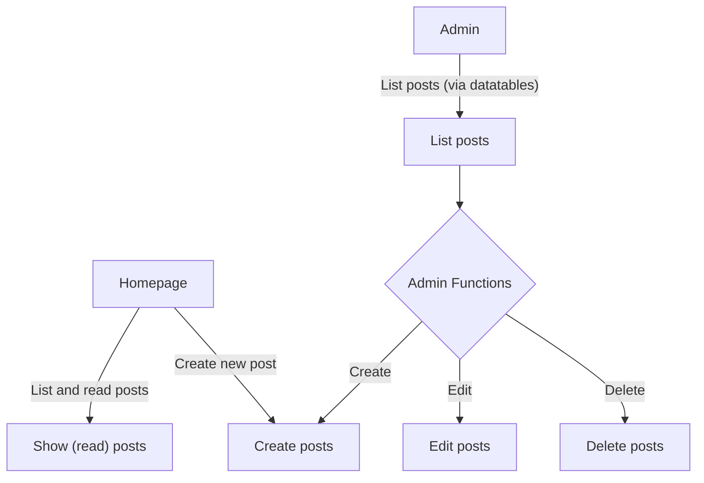
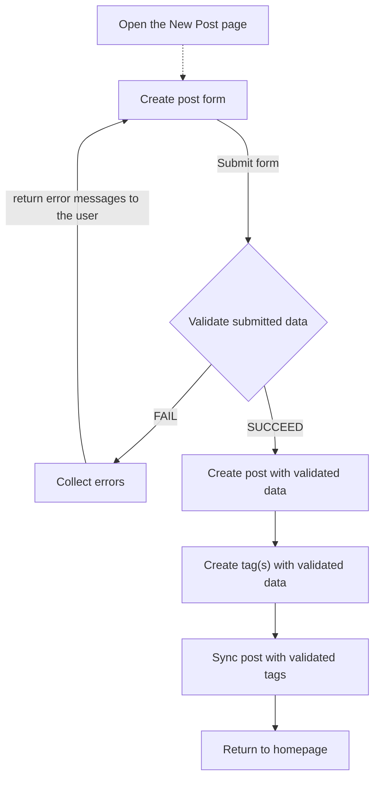

# larablog

## commands to run before using the app

### AUTOMATIC

run `clean.bat`, so it automatically runs the needed commands.

### MANUAL

Copy `env.example` and renamte it to `.env`

Run `composer install` and `npm install`.

`npm run build` or optionally `npm run dev` with vite, or `npm run watch` with mix

`php artisan migrate:fresh` to get the database up and running. use the `--seed` argument to seed the database with posts and tags.

If things seem off, try running the `php artisan cache:clear` command to clear the cache.

Generate new secret key with `php artisan key:generate`

You could also use `CTRL + F5` to refresh the browser.

## Features

### MVP

- [x] Post migration and model
- [x] Tag migration and model
- [x] Post controller
- [x] Tag controller
- [x] Populate DB with faker, factories and seeders
- [x] Post
  - [x] B (R)
  - [x] R (R)
  - [ ] E (U)
  - [x] A (C)
  - [ ] D (D)
- [ ] TAG
  - [x] B (R) (api)
  - [x] R (R) (api)
  - [ ] E (U) (soon)
  - [x] A (C) 
  - [ ] D (D) (soon)
- [x] blade templates
  - [x] base template
  - [x] nav template
  - [x] homepage
  - [x] show (singular post read template)
  - [x] create (post creation template)
  - [x] all with some basic style
- [ ] Create posts
  - [x] base form
  - [x] validation
  - [x] select2
    - [x] custom tag search method :: api for search
  - [x] error messages & old data
  - [ ] WYSIWYG editor: probably CK Editor
- [x] Items to components (some of them)
  - [x] card/block
    - [x] post title item
    - [x] post tag item (capsule/pill)
    - [ ] text input field item with label
  - [x] navbar
    - [x] navbar item
- [ ] List posts
  - [x] listing
  - [ ] search in title and filter tags (only existing ones)
  - [x] Pagination
- [ ] Admin panel
  - [ ] list posts
  - [ ] datatables
    - [ ] function buttons
      - [ ] edit posts
      - [ ] delete posts
      - [ ] modals (sweetalert, only for deletion confirmation)

### POST MVP

- [ ] separate select2 js to component

### OPTIONAL

- [ ] css&js upgrade
- [ ] image upload & delete
- [ ] add livewire
- [ ] switch components to vue components
- [ ] "estimated read time" calculator ()

# MAPS

### SITE MAP&FUNCTIONALITIES

### PROCESS OF POST CREATION

